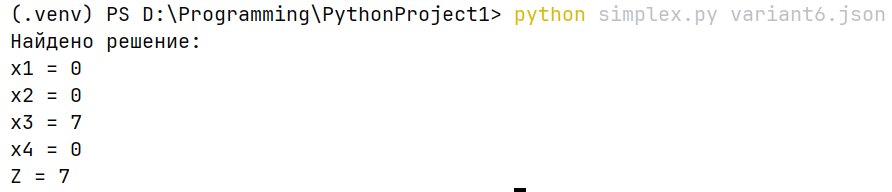
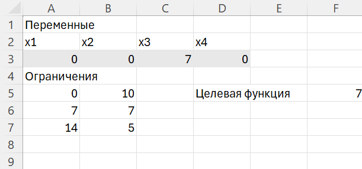

# Задание №1. Разработка программного обеспечения для решения задачи линейного программирования

Ф.И.О: Соболев Артём Анатольевич
Поток: МЕТОПТ 1.1

## Описание алгоритма решения ЗЛП

### Формат файла

```
{
  "sense": "тип задачи"
  "c": [коэффициенты целевой функции]
  "A": [матрица коэффициентов ограничений]
  "b": [правая часть ограничений]
  "constraints": [знаки ограничений]
}
```

### 1) Считывание файла

```
вход = прочитать JSON
sense, c, A, b, cons = данные из входа
```

### 2) Приведение к каноническому виду

```
если sense = "min":
    c_max = -c
иначе:
    c_max = c

для каждой строки i:
    если b[i] < 0:
        A[i,*] = -A[i,*]
        b[i] = -b[i]
        поменять знак ограничения cons[i]
    если cons[i] = ">=":
        A[i,*] = -A[i,*]
        b[i] = -b[i]
        cons[i] = "<="
```

### 3) Сборка таблицы

```
создать пустую таблицу T размера (m+1, n_total+1)
для каждой строки i:
    добавить коэффициенты A[i,*]
    добавить b[i] в последний столбец

если ограничение "<=":
    добавить столбец переменной s_i с коэффициентом +1
    отметить её как базисную
если ограничение "=":
    оставить без изменений

сохранить:
    basis - список базисных столбцов
    var_types - список типов переменных ("x", "s")
    n_original - количество исходных переменных
```

### 4) Поиск базиса 

```
для каждой строки i:
    если basis[i] = -1:
        найти столбец j, где T[i,j] != 0
        выполнить выполнить преобразование таблицы по ведущему элементу
        basis[i] = j
```

### 5) Формирование строки цели

```
создать вектор c_ext длины всех переменных
для каждого j:
    если var_types[j] = "x" и j < n_original:
        c_ext[j] = c_max[j]
    иначе:
        c_ext[j] = 0

вызвать set_objective_coef(T, basis, c_ext):
    obj = c_ext
    для каждой базисной переменной bcol:
        obj -= c_b * строка_таблицы[bcol]
    строка цели = -obj
```

### 6) Решение основной задачи

```
повторять:
    j = индекс минимального отрицательного коэффициента в строке цели
    если таких нет - решение найдено

    i = строка с минимальным положительным отношением b_ij / a_ij
    если подходящей строки нет - решения нет

    выполнить выполнить преобразование таблицы по ведущему элементу
    обновить basis[i] = j
```

### 7) Запись ответа

```
создать вектор x длины n_original, заполненный нулями
для каждой строки i:
    если basis[i] < n_original:
        x[basis[i]] = b[i]

Z_max = b последней строки
если sense = "min": Z = -Z_max, иначе Z = Z_max

округлить x и Z
```

## Развертывание  программы

1) Установить `numpy`

```
pip install -r requirements.txt
```

2) Запустить программу

```
python simplex.py variant6.json
```

## Демонстрация работы программы

### Вариант задания 6

**Постановка задачи**

Минимизировать  
```
Z = 2*x1 + x2 + x3 + 3*x4
```

при условиях  
```
x1 + 2*x2 + x4 <= 10
x1 + x3 + x4 = 7
x2 + 2*x3 >= 5
x1, x2, x3, x4 >= 0
```

### Решение

**Запуск и решение задачи программой:**



**Решение задачи с помощью MS Excel:**



## Вывод

В ходе работы удалось закрепить навыки решения задач линейного программирования и освоить использование симплекс-метода на практике
